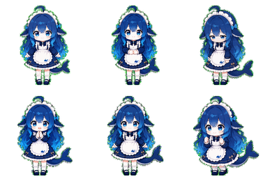

# 🐋 DeepSeek 鲸鱼娘桌宠 (DSH Whale Girl Pet)

DeepSeek Harness 的鲸鱼娘桌面宠物 — 蓝发女仆 + 鲸鱼尾动画，带撒娇互动、任务完成提醒、
晓伊神经网络语音。支持**桌面版**（DSH Desktop 独立置顶小窗）和 **Web 版**（浏览器内
页面右下角悬浮层）。



## ✨ 功能

| 功能 | 说明 |
|---|---|
| 🐋 形象 | DeepSeek 鲸鱼娘官方动画（透明背景，已去绿边/品红残留） |
| 🎞️ 动画 | 待机 / 工作 / 完成 / 出错 / 撒娇 / 跳跃，待机变体轮换 |
| 🗣️ 语音 | 晓伊（XiaoyiNeural）神经网络人声，49 条台词预合成，离线播放 |
| 🥰 互动 | 戳一戳随机反应 / 长按摸头 / 双击静音 / 右键菜单 / 三击诊断 |
| 📢 提醒 | 任务完成（跳跃+纸屑+琶音+语音）、出错安慰、审批提示、进度播报 |
| 🎛️ 音量 | 总音量 + 语音/音效/庆祝分动作音量（持久保存） |
| 🖱️ 拖动 | 桌面版全身拖动；Web 版按住鲸鱼娘拖动 |

## 📦 安装

### 要求
- Windows
- DeepSeek Harness 桌面客户端（`DSH Desktop`）和/或 npx 版 dsh

### 一键安装

```powershell
powershell -ExecutionPolicy Bypass -File install.ps1
```

脚本自动安装到两个 profile 并启用插件（自动备份原文件）：
- 桌面版：`%APPDATA%\dsh-desktop-client\dsh\profiles\web`
- Web 版：`%USERPROFILE%\.dsh\profiles\web`

安装后**重启** DSH 桌面应用 / dsh web 服务生效。

### 卸载

```powershell
powershell -ExecutionPolicy Bypass -File install.ps1 -Uninstall
```

## 🎮 使用

### 桌面版
| 操作 | 效果 |
|---|---|
| 按住角色任意位置 | 拖动窗口 |
| 单击帽子 | 戳一戳（随机撒娇/蹦跳/委屈） |
| 长按帽子 0.7s | 摸头（开心蹦跳） |
| 双击帽子 | 静音 / 恢复 |
| 右键帽子 | 功能菜单（音量/测试/诊断/版本/刷新） |
| 三击帽子 | TTS 诊断面板 |

### Web 版
| 操作 | 效果 |
|---|---|
| 按住鲸鱼娘 | 拖动悬浮面板 |
| 右上角 ✕ | 隐藏（变 🐋 按钮） |
| 点击 🐋 | 恢复 |

## 🛠️ 重新合成语音 / 加台词

需要 Python 3.9+：

```powershell
pip install edge-tts
python tools\synth_all.py      # 用晓伊音色合成全部台词 → lib/audio.json
node tools\build-pet.mjs       # 把语音 + 动画注入 pet.html
```

然后把生成的 `lib\pet.html` 复制回两个 profile（或重新运行 install.ps1）。

## 📁 结构

```
dsh-whale-pet/
├── install.ps1                 # 一键安装/卸载
├── plugin/
│   └── dsh-balance-widget/     # 桌宠插件
│       ├── package.json
│       └── lib/
│           ├── index.js        # 服务端：/pet.html /api/status /api/balance
│           ├── client.js       # 客户端：余额徽章 + Web 版悬浮桌宠
│           └── pet.html        # 桌宠页面（动画+语音+交互）
└── tools/
    ├── synth_all.py            # 语音合成（edge-tts）
    ├── build-pet.mjs           # 构建 pet.html
    ├── despill.py              # 去绿幕残留
    ├── defringe.py             # 去品红残留
    └── patch_client.py         # 同步 WebPet 组件
```

## 📄 License

MIT

## 🙏 致谢

- 角色动画素材：[codex-pet-DeepSeek-girl](https://github.com/xpy12367/codex-pet-DeepSeek-girl)
- 行为系统参考：[DeskPet](https://github.com/2048Nemo/DeskPet)
- 语音合成：[edge-tts](https://github.com/rany2/edge-tts)
